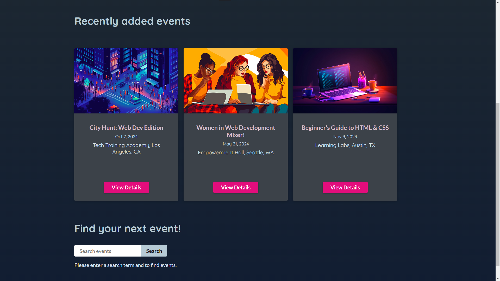

# React Event App

This is a simple React app that allows you to create, view, and edit events. You can use this app to manage your personal or professional events, such as meetings, parties, conferences, etc.

## Features

- The app uses [react-router-dom] to handle routing and navigation.
- The app uses [@tanstack/react-query] to fetch and cache data from a REST API.
- The app has three main components: Events, EventDetails, and NewEvent.
- The Events component displays a list of all events and allows you to create a new event by clicking on the "New Event" button.
- The EventDetails component displays the details of a single event and allows you to edit or delete the event by clicking on the "Edit" or "Delete" buttons.
- The NewEvent component allows you to create a new event by filling out a form with the event name, date, time, location, and description.
- The EditEvent component allows you to edit an existing event by updating the same fields as the NewEvent component.

## Installation

To run this app, you need to have [Node.js] and [npm] installed on your machine. You also need to have a backend server that provides the REST API for the events data. You can use the [json-server] package to create a mock server with some dummy data.

To install the app, follow these steps:

1. Clone this repository to your local machine.
2. Navigate to the project folder and run `npm install` to install the dependencies.
3. Run `npm start` to start the app in development mode. It will open a browser window.
4. In another terminal, navigate to the project folder and run `cd backend`, `npm install` and `npm start` to start the mock server. It will serve the events data.

## Usage

You can use the app to create, view, and edit events. Here are some screenshots of the app:

